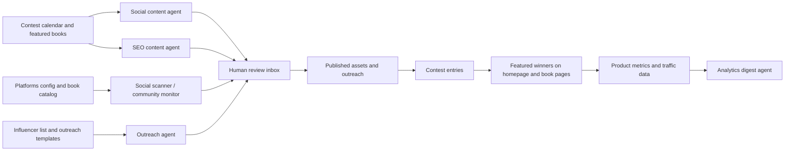
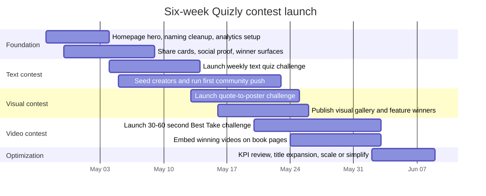

# Quizly Contest-Led Growth Marketing Paper

## Executive summary

The strongest conclusion from the repository and the live site is that Quizly should not market itself as a broad AI playground. It should market one narrower, more repeatable promise: **weekly literary contests that are easy to start, easy to share, and worth returning to**. The repo repeatedly argues for one shareable loop, daily challenge mechanics, share cards, and a clearer landing-page promise, while the current homepage still opens with vague copy and a loading catalog rather than an immediate explanation of value. citeturn4view0turn3view1turn4view2turn18view0

The fastest route is a staged launch. First, fix the homepage, brand naming, share mechanics, and winner visibility. Second, launch **text quiz contests** built on titles already live on Quizly. Third, add **visual contests** that generate highly shareable assets. Fourth, launch **short video contests** and feature the best video directly on the related book page, so contest output becomes evergreen product content rather than a one-off social post. This sequence fits the live site, the repo’s contest suggestions, and the internal book-catalog language that already links books, AI discussion, video generation, and contests. citeturn18view1turn3view0turn16view0

The most useful lesson to adapt from the entity["organization","StartupHub","startup media"] article about entity["company","Sinai.ai","ai books startup"] is not “AI books” as a category slogan. It is the product logic underneath: make reading interactive rather than passive, make it multimodal rather than text-only, and stay rights-conscious rather than casually scraping or remixing copyrighted material. Reframed for Quizly, that becomes: **public-domain or rights-cleared books + contest formats + winning artifacts featured on book pages**. citeturn1search2turn19view1turn19view0turn19view2

The good news is that the existing repo already contains most of the operating system required for this plan: positioning work, audience/channel research, influencer templates, contest/title ideas, a review-first social scanner, an opportunity queue, a syncable book catalog, and an analytics digest concept. The opportunity is not to invent a new marketing stack. It is to **retarget the existing stack around contest campaigns**. citeturn4view1turn10view0turn11view1turn14view0turn17view0turn17view1

Assumptions used throughout this paper: an English-first launch, adults 18+ for the first public pilot, public-domain or rights-cleared book choices, a lean team, and budget modeled in low/medium/high tiers because the request leaves markets and spend open-ended. Those assumptions fit the repo’s audience/channel choices and the current English-language positioning on the live site. citeturn18view1turn3view2turn4view1

## Source synthesis

The source set breaks into three layers: strategy documents in the entity["company","GitHub","developer platform"] repo’s marketing folder, supporting repo files that define the agent/automation model, and the StartupHub/Sinai reporting that suggests how Quizly can extend from text contests into multimodal book experiences. citeturn0view0turn1search2turn19view0turn19view1

### Files reviewed

| Files reviewed | Main findings from the source | How this paper uses them |
|---|---|---|
| `marketing/site_evaluation.md`; `marketing/critical_improvements.md` | These two files identify the main growth blockers as homepage clarity, JS-heavy SEO limitations, inconsistent Quizly/Kvasir naming, weak social proof, lack of email capture, and the absence of a daily challenge plus shareable result cards. citeturn4view2turn3view1 | They anchor the recommendation that contest marketing must begin with a conversion sprint, not with immediate traffic buying. |
| `marketing/coder_instructions.md`; live `/`; live `/brief` | The coder instructions translate the diagnosis into concrete fixes: surface a non-hidden hero, pull stronger copy from `/brief`, simplify the homepage promise, improve mobile fit, and add winner-announcement mechanics. The live site still shows the weak “Game and chat with AI. Contests in prompt crafting” line, while `/brief` already contains much stronger product language and active contest examples. citeturn25view0turn18view0turn18view1 | They justify using existing copy assets rather than inventing a new message architecture from scratch. |
| `marketing/positioning.md` | The position paper argues that Quizly should own a specific mental category: creator-led literary AI contests and games, driven by one shareable loop that users want to repeat, not a generic AI or edtech story. citeturn4view0 | It becomes the central thesis of this paper: one repeatable contest ritual first, broader feature marketing later. |
| `marketing/market_research.md` | The audience set is clear: readers, students, AI-curious users, trivia lovers, and teachers/book-club leaders. The priority channels are short-form video, Reddit, SEO pages around book-title intent, and community outreach. citeturn3view2 | It informs the audience assumptions, channel prioritization, and KPI design in this report. |
| `marketing/promotion_strategy.md` | The promotion plan prioritizes short-form video, Reddit, creator/community outreach, and a five-agent stack: social content, community monitoring, SEO generation, outreach, and analytics digest. citeturn4view1 | It provides the foundation for the agent workflow section and the recommended weekly operating cadence. |
| `marketing/contest_suggestions.md` | The repo already proposes debate-ready, culturally recognizable books and a launch sequence that starts with highly discussable classics and expands outward. citeturn3view0 | It informs the title ladder for after the first wave of on-platform contests. |
| `marketing/influencers/search_results.md`; `marketing/influencers/outreach_templates.md` | The repo already has a 100-contact creator list plus short, personalized outreach templates for book creators, aesthetic creators, and literary organizations. citeturn7view1turn7view0 | It makes micro-creator seeding immediately executable instead of hypothetical. |
| `CLAUDE.md`; `MODIFICATION_PLAN.md`; `src/pipeline.py`; `config/platforms.yaml`; `config/book_catalog.yaml`; `scripts/update_book_catalog.py` | These files define a review-first scanner and opportunity queue, with Reddit and YouTube collection enabled on a 10-minute schedule, optional X support, title/author matching through a book catalog, and a pipeline that dedupes, scores, classifies, queues, and renders an HTML review inbox. The book-catalog CTA explicitly mentions reading the book, discussing it with AI, generating a video, and joining contests. citeturn10view0turn11view1turn14view0turn17view0turn16view0turn17view1 | They make the repo’s automation genuinely useful for contest-led growth, especially for title-specific discovery, creator outreach, and book-page media extensions. |

### Adapted ideas from StartupHub and Sinai

The concepts below are **adapted and rephrased**, not copied. They keep the underlying product logic from the StartupHub/Sinai coverage while translating it into a practical Quizly growth model. citeturn1search2turn19view0turn19view1turn19view2

| Reported concept in the coverage | Adapted Quizly move | What to keep and what to avoid |
|---|---|---|
| Books become interactive and multimodal rather than static. citeturn1search2turn19view1turn19view0 | Turn each featured title into a small **contest hub**: text quiz, visual gallery, and one featured short video. | Keep the multimodal logic; avoid trying to rebuild a full AI-native publishing platform on day one. |
| The product shifts users from passive consumption to active participation. citeturn19view1turn19view2 | Make the contest itself the participation layer: answer, create, submit, share, get featured, return. | Keep the interaction loop; avoid passive “read more” messaging that doesn’t produce shareable output. |
| A legal-first content model matters. citeturn19view1turn19view0 | Start public-domain-first, use explicit entrant licenses, and partner with communities that benefit from the format. | Keep the rights discipline; avoid ambiguous reuse of copyrighted covers, soundtracks, or unlicensed excerpts. |
| The experience can extend the economic life of books and create a new distribution layer. citeturn19view2turn19view1 | Use winning visuals and videos to make each book page richer and more evergreen, so contests feed product content and SEO pages. | Keep the “content becomes distribution” idea; avoid letting winner assets disappear after the social campaign ends. |

## Contest strategy

Quizly’s launch should satisfy three constraints simultaneously: it should use mechanics the product already has, it should create assets that spread externally, and it should leave behind evergreen content on the site after each contest ends. The current site already supports AI games, grounded book chats, and live contests; the repo’s positioning and product evaluations argue that the next step is not more feature breadth but one stronger loop. citeturn18view1turn4view0turn4view2

For the first wave, use current on-platform titles such as entity["book","Hamlet","shakespeare play"], entity["book","The Origin of Species","darwin 1859"], entity["book","Strange Case of Dr Jekyll and Mr Hyde","stevenson 1886"], and entity["book","Alice's Adventures in Wonderland","carroll 1865"], then expand into debate-heavy classics the repo already recommends, including entity["book","Pride and Prejudice","austen 1813"], entity["book","Frankenstein","shelley 1818"], and entity["book","The Great Gatsby","fitzgerald 1925"]. citeturn18view1turn3view0

### Pre-launch fixes that should happen before traffic scaling

| Fix | Why it must happen before the contest push | Deliverable |
|---|---|---|
| Pull the `/brief` promise onto the homepage | The live homepage still presents weak copy and a loading catalog, while the repo explicitly treats the missing/hidden hero as the biggest conversion blocker. citeturn18view0turn25view0turn4view2 | A concise hero with one sentence of value, one primary CTA, and 2–3 featured contest cards. |
| Unify the brand as “Quizly” everywhere | The repo flags Kvasir/Quizly/Quizzly inconsistency as a trust and SEO problem. citeturn3view1turn4view2turn25view0 | One naming pass across page titles, meta tags, on-page headings, and social previews. |
| Add daily challenge + shareable result cards | The repo treats this as the highest-leverage organic growth mechanic. citeturn3view1turn25view0 | One 5-question daily text challenge plus image/result cards and one-click sharing. |
| Add social proof and email capture | The repo repeatedly notes the absence of trust indicators and re-engagement hooks. citeturn4view2turn3view1 | “Games played this week,” contest-entry counts, featured winners, and a simple email capture. |
| Add explicit winner surfaces | The coder instructions say creation announcements already work, but contest-level winner announcements and winner surfacing still need stronger tooling. citeturn25view0 | Winner announcement button, winner module on homepage, and winner slots on book pages. |

### Prioritized quick-to-launch portfolio

| Priority | Contest format | Recommended mechanic | Why this order | Planning estimate |
|---|---|---|---|---|
| First | **Text quiz contest** | A weekly featured book gets one daily 5-question quiz for broad participation, plus one tie-breaker open prompt for “editor’s pick” answers. Result cards are instantly shareable, and the best text answer becomes a featured annotation on the book page. | This is the fastest path because the repo already prioritizes daily challenge loops and share cards, and the current site already has live contests and grounded book-chat mechanics. citeturn3view1turn18view1 | 5–7 days to launch once hero/share instrumentation is ready. |
| Second | **Visual contest** | “Quote-to-poster” or “scene-as-cover” challenges based on the featured title. Entrants submit one image plus a short creator note explaining the interpretation. Winners populate a gallery on the contest page and the related book page. | Visuals add stronger social spread than text, but they require more moderation and clearer IP controls. They should follow text once the submission and winner flow is proven. citeturn3view0turn18view1 | 7–12 days after text launch. |
| Third | **Video contest** | One 30–60 second vertical video: reaction, argument, reenactment, explainer, or screen-recorded AI interaction around the featured title. The best video becomes the permanent “Watch the best take” panel on the book page. | Video has the highest upside for organic reach and aligns most closely with the multimodal lesson from Sinai, but it also has the highest production friction and rights/moderation risk. citeturn19view1turn19view0turn16view0 | 10–18 days after text launch. |

A good naming system is more important than a large menu. The simplest working taxonomy is: **Book Duel** for text, **Quote to Poster** for visual, and **Best Take** for video. That keeps the system legible across site cards, creator outreach, and social posts.

### Best video to books module

A winning video should not vanish inside a social feed. It should be promoted to a durable module on the book page with four parts: the video itself, a transcript, a spoiler flag, and a CTA to make a competing version. That move directly adapts the multimodal-book logic from the Sinai coverage, and it is also consistent with the repo’s own internal book-catalog wording, which already describes a book experience that combines reading, AI discussion, video, and contests. citeturn19view1turn19view0turn16view0

| Module field | Recommendation |
|---|---|
| Placement | Above the main “chat with the book” CTA on the book page |
| Asset spec | Vertical 9:16 video, 30–60 seconds, transcript required |
| Selection method | One editor’s pick, one community pick when volume is high enough |
| Reuse package | Non-exclusive display and promotion rights; attribution preserved |
| Core CTA | “Watch the best take” and “Make your own version” |
| Success metric | Play rate, click-to-contest rate, book-page engaged time |

## Agent workflows

The repo already describes a marketing machine that is unusually close to what Quizly needs right now: a review-first social scanner, content generation, SEO page creation, outreach drafting, and a weekly analytics digest. The most important operational rule in those documents is that the system is **assistive, not autonomous**. That is the right posture for contest-led growth because selection, moderation, and voice still need human review. citeturn4view1turn10view0turn11view1turn14view0

The current configuration is especially useful for this plan because Reddit and YouTube collection are enabled, the pipeline already dedupes and scores candidate opportunities, and the book catalog can be synced and expanded to catch author/title mentions. citeturn17view0turn14view0turn16view0turn17view1

### Workflow matrix

| Agent | Step-by-step task flow | Inputs | Outputs | Automation points | Estimated time and resources | Repo basis |
|---|---|---|---|---|---|---|
| **Launch agent** | 1) Pull the homepage hero and copy fixes from the repo guidance. 2) Add share cards, winner announcement controls, and featured winner slots. 3) Add one reusable “best video” block to book pages. 4) QA mobile and desktop flows. 5) Deploy and verify event tracking. | Homepage copy, `/brief` copy, current contest cards, design tokens, analytics tags | Updated homepage, improved contest UX, winner surfaces, book-page media slot | One-time build plus weekly QA on launch days | 3–6 dev days initial, then 2–4 hours/week maintenance; one product engineer plus light QA | citeturn25view0turn22view0turn18view0turn18view1 |
| **Social scanner / community monitor** | 1) Load `platforms.yaml`, targets, and book catalog. 2) Collect fresh Reddit and YouTube candidates. 3) Dedupe and pre-score. 4) Send contest-relevant items to the decision layer. 5) Render an HTML inbox of reply/post opportunities. 6) Human reviews and publishes manually. | Featured books, contest keywords, target community list, title aliases, platform config | Ranked opportunity queue, suggested reply angles, suggested comment/post drafts | 10-minute scheduler, HTML review page, stale-item expiration | 20–40 minutes/day of human review once running; one growth owner | citeturn10view0turn11view1turn14view0turn17view0turn16view0 |
| **Social content agent** | 1) Ingest the week’s featured title, winner assets, and contest brief. 2) Generate 3 short-form hooks, 1 Reddit discussion angle, 1 creator-facing pitch, and 1 evergreen CTA. 3) Human selects variants. 4) Publish to the weekly content queue. 5) Feed performance back into the next week’s prompts. | Contest brief, book title, winner snippets, screenshots, product CTA | Content queue for short-form video, community posts, and landing-page refreshes | Repeatable prompt templates and batch generation | 45–90 minutes/day including founder review and publishing | citeturn4view1turn18view1 |
| **SEO content agent** | 1) Generate one evergreen page per featured title: quiz page, discussion-questions page, and contest hub page. 2) Add internal links to the live contest. 3) Feature the winning visual/video asset after each round. 4) Refresh metadata and related-book links. | Featured title list, contest CTA, winner assets, title aliases | Search-oriented static pages that also function as contest landing pages | Weekly batch generation and deployment | 2–4 hours/week for review, link checking, and publish QA | citeturn4view1turn16view0 |
| **Outreach agent** | 1) Rank the existing creator list by relevance to the week’s featured book and format. 2) Draft 5–10 personalized short messages from the repo templates. 3) Human approves and sends. 4) Log replies and attach unique tracking codes. 5) Re-contact warm leads with custom contest prompts. | Influencer list, outreach templates, featured title, prize/reward terms | Outreach queue, personalized drafts, CRM-style tracker | Template reuse and contact scoring | 2–3 hours/week of human sending and follow-up | citeturn7view1turn7view0 |
| **Analytics digest agent** | 1) Pull site traffic, contest funnel events, email opt-ins, and page-level performance. 2) Summarize which titles and assets drove starts, shares, and signups. 3) Publish a weekly scorecard with keep/kill decisions. | Traffic analytics, database events, search data, contest status | Weekly markdown or dashboard digest | Scheduled weekly report generation | 45–60 minutes/week review by growth lead | citeturn4view1 |

The leanest workable staffing model is one growth owner, one product engineer, one part-time designer/editor, and one moderator/reviewer. In the lowest-budget mode, those roles can be fractional; in medium or high budget, they should be assigned named owners.

Distribution should focus first on entity["company","TikTok","short video platform"] for short demos, entity["organization","Reddit","social platform"] for intent-rich discussion and educator/book-club communities, and entity["company","YouTube","video platform"] for searchable explainers and video-comment discovery. That matches both the repo’s channel strategy and the current enabled collector setup. citeturn4view1turn17view0

## Campaign economics and measurement

The campaign should be run as a six-week pilot that starts on **April 27, 2026**. That is long enough to fix the obvious conversion blockers, prove one text loop, add one visual loop, test one video loop, and see whether featured winner assets improve both sharing and on-site engagement. The phasing below follows the repo’s priority order: fix clarity and sharing first, then expand promotion and formats. citeturn3view1turn25view0turn4view1

### Budget ranges

These ranges are **planning estimates**, not externally benchmarked price quotes. They assume a six-week pilot and include notional contractor/staff time.

| Budget tier | Team shape | Prize and media mix | Illustrative six-week range | Right use case |
|---|---|---|---|---|
| **Low** | Founder-led growth, part-time dev, part-time design/editing, manual moderation | Small prize pool, mostly organic distribution, limited creator seeding | **$3,000–$7,000** | Best for proving the loop before serious scale |
| **Medium** | Dedicated growth owner, stronger editing/design support, light moderation layer | Larger prize pool, 10–25 micro-creator collaborations, some paid boosting of top-performing assets | **$12,000–$25,000** | Best for turning a working loop into repeatable acquisition |
| **High** | Dedicated growth plus product and community support | Premium prize pool, broad creator seeding, always-on paid amplification, faster content operations | **$35,000–$80,000** | Best only after one low-cost loop already shows strong activation and retention |

A sensible prize mix is **feature exposure + winner badges + creator profile promotion + modest cash or gift rewards**. That is more aligned with the repo’s creator-economy positioning than a purely cash-based contest stack. citeturn4view0

### KPI framework and measurement plan

The repo’s generic success metrics are signups, games played, shares, search impressions, social mentions, and teacher/book-club uptake. For a contest-led paper, those should be restructured into one contest-first scoreboard. citeturn4view1

| KPI | Definition | Recommended week-six target | Review cadence | Decision use |
|---|---|---|---|---|
| **Qualified contest participants** | Unique users who complete a text quiz or submit a visual/video entry | 250+ low / 750+ medium / 2,000+ high | Weekly | Primary north-star metric |
| **Landing-to-start rate** | Contest starts ÷ landing-page sessions | 15–25% | Daily / weekly | Tests homepage and CTA quality |
| **Text completion rate** | Completed text quizzes ÷ text starts | 35–50% | Daily / weekly | Validates daily challenge friction |
| **Visual submission rate** | Visual submissions ÷ visual challenge starts | 8–15% | Weekly | Measures participation depth |
| **Video submission rate** | Video submissions ÷ video challenge starts | 5–10% | Weekly | Measures creator willingness |
| **Share rate** | Share clicks or tracked outbound shares ÷ completed entries | 20%+ text / 30%+ visual / 35%+ video | Weekly | Measures viral health of the loop |
| **Participant-to-signup rate** | New registrations ÷ qualified participants | 8–15% | Weekly | Measures conversion into owned audience |
| **D7 repeat participation** | Participants active again within 7 days | 20–30% | Weekly | Measures ritual formation |
| **Book-page media CTR** | Clicks from a book page’s winner module to contest CTA | 5–10% | Weekly | Measures whether winner assets improve product discovery |
| **Moderation SLA** | Median time from submission to approval/rejection | Under 24 hours | Daily / weekly | Measures trust and ops readiness |

For tracking, use a simple event taxonomy: `landing_view`, `cta_join_contest`, `text_quiz_start`, `text_quiz_complete`, `visual_submit`, `video_submit`, `share_click`, `winner_featured`, `book_video_play`, `signup_complete`, and `return_7d`. Every creator and community link should carry a unique UTM or referral code.

### Recommended dashboard layout

The repo’s analytics-digest concept is strong; what changes here is the layout. The dashboard should answer one question each week: **Which title-format combinations create the best participation and the best evergreen site value?** citeturn4view1

| Dashboard row | Suggested chart | What it should show | Primary action it should trigger |
|---|---|---|---|
| **Acquisition** | Stacked area or stacked bar by channel | Sessions and qualified participants by TikTok, Reddit, YouTube, SEO, creator links, direct | Shift effort toward the channels that produce entrants, not just visits |
| **Contest funnel** | Funnel chart | Landing view → contest start → completion/submission → share → signup | Find the single biggest drop-off point each week |
| **Creative performance** | Horizontal bar chart by asset/hook | CTR, start rate, and share rate by creative angle | Keep winning hooks; kill weak ones |
| **Book-page impact** | Dual-axis line chart | Book-page sessions, winner-video plays, click-through to contest | Judge whether featured assets create evergreen lift |
| **Retention** | Cohort heatmap | D1, D7, D30 repeat activity for entrants by contest type | Decide whether the loop is becoming a habit |
| **Operations** | Aging chart plus approval-rate table | Pending moderation, SLA, approval/rejection rates, flagged content | Prevent moderation debt from killing trust |

## Creative system

The repo’s own diagnosis is that Quizly lacks a clear above-the-fold explanation for new visitors, and the contest editor lacks good examples and prompt guidance. The creative system therefore needs to solve not only promotion but also comprehension. The templates below are designed to do both. citeturn25view0turn18view1

A clean homepage hero for the pilot should read like this:

> **Play AI games. Debate book characters. Win creative contests.**  
> Turn classic books into text quizzes, visual challenges, and short video takes.  
> Start free in your browser.  
> **CTA:** Join this week’s contest

### Creative brief template for text quiz contests

**Objective:** Drive repeat visits and fast, low-friction participation.  
**Audience:** Curious readers, students, trivia fans, and first-time visitors.  
**Featured title:** [Book title].  
**Core hook:** [What is the one irresistible question or tension?]  
**Format:** 5-question quiz plus 1 optional tie-breaker open response.  
**Completion time:** 2–4 minutes.  
**Scoring:** Auto-score the quiz; editor selects best tie-breaker answer.  
**Share asset:** Auto-generated result card with score, title, and CTA.  
**Prize:** Winner feature on the book page + social mention + optional small reward.  
**Rights:** User grants permission to display their answer snippet and username.  
**Success threshold:** Start rate above 15%; share rate above 20%.

### Creative brief template for visual contests

**Objective:** Produce high-share visual artifacts and stronger social proof.  
**Audience:** Book creators, design-minded readers, aesthetic communities.  
**Featured title:** [Book title].  
**Prompt:** [Turn one quote or scene into a poster / cover / visual interpretation.]  
**Format:** One image plus a short creator note explaining the interpretation.  
**Design constraints:** [Aspect ratio, safe text zones, any spoiler rules.]  
**Judging criteria:** Originality, relevance to the text, visual clarity, and memorability.  
**Prize:** Homepage or book-page gallery feature, creator credit, optional cash or voucher.  
**Rights:** Non-exclusive right to host, display, crop, and promote the image with attribution.  
**Success threshold:** Submission rate above 8%; share rate above 30%.

### Creative brief template for video contests

**Objective:** Win organic reach and create evergreen “best take” media for book pages.  
**Audience:** Short-form creators, explainers, reaction creators, educators.  
**Featured title:** [Book title].  
**Prompt:** [Give your best 30–60 second take / argument / reenactment / explainer.]  
**Format:** Vertical video, 9:16, 30–60 seconds, captions required.  
**Allowed styles:** Talking head, screen recording, voiceover, reaction, mini-essay.  
**Judging criteria:** Clarity, originality, narrative momentum, and fit to the source text.  
**Prize:** Permanent “Editor’s Pick” slot on the book page, social amplification, optional cash.  
**Rights:** Non-exclusive right to embed, subtitle, clip, and promote the video with attribution.  
**Success threshold:** Submission rate above 5%; video winner CTR from book page above 5%.

### Sample promotional copy, social posts, and ad-creative variants

| Variant | Channel | Sample copy | Creative direction | CTA |
|---|---|---|---|---|
| **Hero** | Homepage | **Play AI games. Debate book characters. Win creative contests.** This week’s challenge turns a classic book into a text quiz, a poster prompt, and a short video battle. | Clean hero with three contest cards: Text, Visual, Video | Join this week’s contest |
| **Text contest hook** | Short-form video | “I thought I knew Hamlet. Then Quizly gave me five questions and I blanked on two. Can you beat my score?” | Screen recording plus score card reveal | Take today’s book duel |
| **Visual contest hook** | Reels / carousel | “One line from a classic book. One poster. Best interpretation gets featured on the book page.” | Quote card → artwork reveal → winner slot mockup | Submit your poster |
| **Video contest hook** | Shorts / reels | “Give me your best 45-second take on whether Gatsby is tragic, delusional, or both. Best answer gets featured.” | Talking head with timer, book art, and comment bait | Post your best take |
| **Community post** | Forum / discussion thread | “We’re testing a weekly literary challenge where people can quiz themselves on a classic, submit a creative response, and see the best entry featured on the book page. Which title would you actually try first?” | Text-first discussion post; no hard sell in the opener | Suggest the next book |
| **Teacher / book club email** | Email | “I run Quizly, a browser-based set of AI book challenges. We’re piloting a weekly literary contest that works well as a discussion warm-up: fast text quiz, optional creative prompt, and a featured winner. If useful, I can send a private link for your group.” | Plain-text, credibility-first email | Request the private link |
| **Creator DM** | Creator outreach | “Your audience already talks about classics in a way that feels perfect for a weekly Quizly challenge. I’d love to set up a custom prompt around [title] and let you react to it in your own style.” | Short, personalized opener based on recent content | Try a custom challenge |
| **Paid ad headlines** | Search / paid social | “Beat the Book in 5 Questions” / “Turn Classics Into Contests” / “Watch the Best Take, Then Make Yours” | Static card or 9:16 UGC-style teaser | Play free in your browser |

## Governance and next steps

The legal and ethical baseline should follow guidance from the entity["organization","U.S. Copyright Office","us copyright agency"], the entity["organization","Federal Trade Commission","us consumer agency"], platform disclosure rules, and the repo’s own review-first moderation posture. This section is an operational checklist, not legal advice; if Quizly expands beyond low-risk public-domain pilots, counsel should review the official rules and submission terms. citeturn23view0turn24view0turn24view1turn23view1turn23view2turn23view4turn10view0turn18view0

### Legal and ethical checklist

| Risk area | Operational requirement | Source basis |
|---|---|---|
| **Source material and excerpts** | Use public-domain or licensed books wherever possible. If a contest uses copyrighted third-party material, do not assume permission; obtain it or narrow the use. | The Copyright Office states that works are generally protected upon creation, permission may be required, and fair use is contextual rather than a simple word-count rule. citeturn24view0turn23view0 |
| **Rights in submissions** | Require entrants to confirm that they own or control their submission and to grant Quizly a non-exclusive right to host, display, crop, subtitle, embed, and promote it. | Circular 66 explains that third-party website content remains owned by its author unless rights are transferred, and that user-generated content can be claimed only where the authors and transfer are properly identified. citeturn24view1 |
| **AI-generated entries** | Reward human direction, explanation, editing, narration, and interpretation. Do not frame fully machine-made output as cleanly ownable by default. | The Copyright Office’s 2025 AI copyrightability report says wholly AI-generated material is generally not copyrightable, while human contribution remains central to the analysis. citeturn23view3 |
| **People in images and videos** | Require entrant confirmation that recognizable people appearing in a submission have consented. For the first public pilot, keep the contest 18+ or require guardian consent where relevant. | COPPA applies when services are directed to children under 13 or knowingly collect personal information from them. citeturn23view2 |
| **Influencer and creator disclosures** | Require creators to disclose material relationships clearly and close to the endorsement. On TikTok, require the commercial-content disclosure setting when applicable. | FTC guidance requires disclosure of material connections, and TikTok requires the content disclosure setting for promotional posts. citeturn23view1turn23view4 |
| **Prize and rules transparency** | Publish official rules with eligibility, judging criteria, prize value, entry deadlines, verification steps, and the sponsor’s rights in featured work. If any activation starts to resemble a sweepstakes, add no-purchase clarity and legal review immediately. | FTC contest and prize-promotion materials emphasize eligibility verification, releases, and clear prize-promotion terms; telemarketing guidance also stresses no-purchase disclosure in prize promotions. citeturn26search1turn26search5turn26search6 |
| **Email capture and outreach** | For newsletters and creator outreach, identify the sender and provide a working opt-out. | The FTC’s CAN-SPAM guide applies to commercial email and requires core compliance mechanics. citeturn26search7 |
| **Moderation and automation ethics** | Keep all posting, winner selection, and featured-content decisions human-reviewed. Enforce rules against harmful, illegal, or inappropriate content before surfacing submissions. | The repo defines the scanner as assistive rather than autonomous, and the live site’s request form already requires users to avoid harmful, illegal, and inappropriate content. citeturn10view0turn11view1turn18view0 |

### Prioritized next steps

The order below mirrors the repo’s priority stack: fix clarity and sharing first, prove one repeatable loop second, and only then widen the format and channel surface. citeturn3view1turn25view0turn4view0turn4view1

1. **Ship the homepage and brand cleanup in the first working week.** Move the `/brief` promise onto the homepage, standardize the Quizly name, and give first-time visitors one clear CTA into the weekly contest.

2. **Add share cards, event tracking, email capture, and winner surfaces in the same sprint.** Contest-led growth breaks if sharing, attribution, and re-engagement are missing.

3. **Launch one weekly text contest built on titles already live on the platform.** Start with the lowest-friction format because text is the fastest way to prove participation depth and social sharing.

4. **Use the existing creator list and outreach templates to recruit the first 10 micro-creators.** Do not wait to “build a creator program”; run a controlled pilot with a trackable link per creator.

5. **Turn the scanner and content agents toward one featured title each week.** The automation should help answer one question: where can Quizly place this week’s contest naturally?

6. **Publish three evergreen pages for every launch title.** One quiz page, one discussion page, and one contest hub page is enough to start compounding from search and internal linking.

7. **Launch the visual contest only after the text loop has a stable winner flow.** The visual format should inherit the same CTA, same weekly theme, and same winner-prominence logic.

8. **Launch the short-form video contest only after moderation and rights language are ready.** The gain is large, but so is the risk if the rights package and review flow are vague.

9. **Embed the winning video and winning visual on the related book page immediately after each cycle.** This is where social output becomes permanent product content.

10. **Run a week-six keep/kill review.** Scale only if the text loop reaches a meaningful start rate, entrants return within a week, creator outreach produces replies, and featured assets measurably improve book-page engagement.